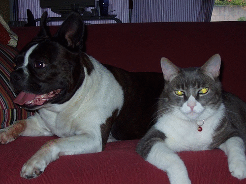

# Robotics detection modules
[](https://travis-ci.org/raviBhadeshiya/enpm808x-robotics-detection-module)
[](https://coveralls.io/github/raviBhadeshiya/enpm808x-robotics-detection-module?branch=master)
[](LICENSE.md)

---   

## Overview   

ENPM808x: **Deep Learning Based Object Detector**  

Since the inception of the twenty-first century, the autonomous robot has been dominating the consumer market. To function properly in the unpredicted environment Re, they should avoid the collision, follow the lane properly and constantly look for a better path which requires knowledge of the environment. The robotics vision has made tremendous progress in addressing problems. In this midterm project, deep learning-based object detector implemented for ACME Robotics which enable the robot to acquire knowledge of the environment and provide the ability to an appropriate reaction strategy or planning scheme; a simple and widely applicable strategy being to stop the robot.

- This detection module first preprocess input image and detect multiple object with help of [pre-trained deep nerual net](https://github.com/weiliu89/caffe/tree/ssd#models). It will try to identify every object present in scenes and filter out some irrelevant objects with lower confidences which enable precision every time. The nerual net can be further trained for task relevant objects. The deep learning-based object detector can process approximately 30-25 FPS (depending on the speed of your system).
- This module uses the technique called [Single-Shot Detector](https://arxiv.org/abs/1512.02325) to detect multiple objects on image. The Caffe based OpenCv Nerural Net was incorporated for this module. For more ref:[Click Here](https://github.com/weiliu89/caffe/)
- For this module, Camera class was also developed to provide the input data for detection by reading jpg/png images or reading video files with format mp4/avi.However, with a little modification, it can access the any hardware cameara and provide the live stream for detection which is extremely useful for real-time.

### Result
The following result was shown by running the program with sample image sequences.   
Following sample images were processed with ~40 ms time.
<p align="center"></p>

----
### Required Depandencies
[](http://www.boost.org/users/history/version_1_65_1.html)
[](https://docs.opencv.org/trunk/d7/d9f/tutorial_linux_install.html)

### Build via command-line
```
git clone --recursive https://github.com/raviBhadeshiya/enpm808x-robotics-detection-module.git
cd <path to repository>
mkdir build
cd build
cmake ..
make -j$(nproc)
```
- To Run tests:```./test/cpp-test```  
- To Run program:``` ./app/shell-app <path>/filename```  
- To Run program with Image Sequence:``` ./app/shell-app ../data/*.jpg```
- To Run program with video:``` ./app/shell-app ../data/test.mp4```  

This detection module also support live stream from hardware camera which can be build by defining the preprocessor  ```#define CAMERA_ENABLE``` in 
**Camera.hpp** and following the build and running with ``` ./app/shell-app ```.

---
### Documentation 
- Detailed documentation can be found under ```/doc/html/index.html``` 
- To genrate documentation, type this in terminal ```sudo ap-get install doxygen-gui``` and generate it by following simple steps from [here](https://www.stack.nl/~dimitri/doxygen/manual/doxywizard_usage.html).

---
### Solo Iterative Process
Solo Iterative process was used for developing this module It can be observed that estimates were improved over time.   
For detailed spreadsheet: [](https://docs.google.com/spreadsheets/d/1QMfyDhY2k-3UoVmqBBLPma-o_mvVv3tEnGuCV8GbJtA/edit?usp=sharing)

--- 
